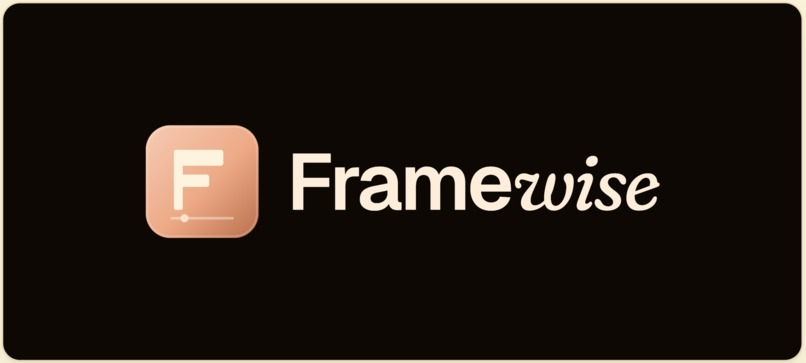
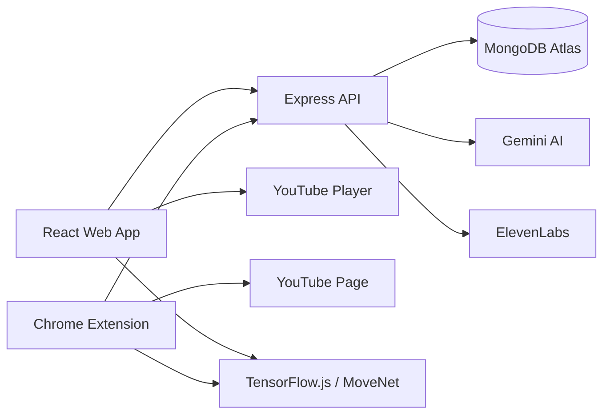

<p align="center">
  
</p>

<h1 align="center">Framewise</h1>

<p align="center">
  <strong>AI-powered video learning for studying, captions, chat, and dance practice.</strong>
  <br />
  A connected web app + Chrome extension that turns YouTube videos into interactive learning workspaces.
</p>

<p align="center">
  <a href="https://devpost.com/software/framwise"><strong>Devpost</strong></a>
  ·
  <a href="#local-setup"><strong>Local Setup</strong></a>
  ·
  <a href="#chrome-extension"><strong>Chrome Extension</strong></a>
  ·
  <a href="#api-reference"><strong>API Reference</strong></a>
</p>

<p align="center">
  
  
  
</p>

---

Framewise is a full-stack AI video assistant built around a simple idea: videos should be searchable, conversational, captioned, and practice-ready. It has two connected surfaces — a **React web app** and a **Chrome extension** — that share the same backend, MongoDB database, auth token, and AI pipeline.

## Hackathon Recognition

Framewise started at **HackHCC: Code Runners Hackathon**, where it won:

- **Best Use of MongoDB Atlas**
- **Best Use of AI**

Devpost: [Framewise on Devpost](https://devpost.com/software/framwise)

---

## At a Glance

| Surface | What it does | Best for |
|---|---|---|
| **Web App** | Analyze videos, manage a library, chat with content, generate captions, notes, quizzes, and practice sessions | Deep study and full-screen practice |
| **Chrome Extension** | Works directly on YouTube with timeline summaries, caption injection, quick notes/bookmarks, and practice links | Learning inside the video you are already watching |
| **Shared AI Backend** | Gemini analysis/chat, ElevenLabs voice/STT, MongoDB persistence, async jobs, caching, and adaptive mode detection | One account and one AI memory across both products |

## Contents

- [Product Highlights](#product-highlights)
- [Chrome Extension](#chrome-extension)
- [Tech Stack](#tech-stack)
- [Architecture](#architecture)
- [Project Structure](#project-structure)
- [Local Setup](#local-setup)
- [Demo Flow](#demo-flow)
- [Challenges & Technical Notes](#challenges--technical-notes)
- [API Reference](#api-reference)
- [Known Limitations](#known-limitations)

---

## Product Highlights

### Web App

**Video Analysis**
- Paste any YouTube URL and Gemini watches the actual video (not just transcript) to generate a structured topic timeline
- Analysis runs as an async background job; the UI polls with a progress bar and rotating status messages
- Analyzed videos are cached — reopening the same URL loads instantly

**Timeline & Seeking**
- Clickable segment timeline with title, timestamp, and summary for each section
- Seek the embedded YouTube player by clicking any segment or chat-referenced timestamp

**Chat**
- Contextual AI chat per video — knows the transcript, timeline segments, current playback position, and conversation history
- Timestamped jump buttons on relevant answers
- ElevenLabs voice replies (Narrator or Coach voice preset, toggle-able per session)
- Typing indicator, markdown bold rendering, error display

**Notes & Bookmarks**
- Manual notes and AI-generated notes from the full transcript
- Bookmarks with labels, edit/rename support

**Quiz**
- Gemini generates quiz questions by watching the actual video content
- Multiple choice Q&A displayed inline

**Captions**
- Fetch YouTube's own transcript captions with precise timestamps
- ElevenLabs STT audio transcription fallback for videos without captions
- AI correction pass (Gemini) to clean up auto-captions
- Translation to any language
- Download as `.srt` or `.txt`

**Practice Tab — Video Pose Tracking**
- "Start Pose Tracking" button captures the browser tab via `getDisplayMedia` and runs MoveNet MULTIPOSE_LIGHTNING directly on the video
- Orange skeleton overlaid on the YouTube player — aligned to the actual player bounds, works in both windowed and fullscreen modes
- Auto-selects the most-centered person in multi-dancer videos; a compact `Auto / 1 / 2 / 3` picker lets you lock onto a specific dancer
- Person number labels appear above each detected dancer when multiple people are in frame
- **Framewise Fullscreen** button (⊞) inside the player corner — calls `requestFullscreen()` on the player wrapper so the skeleton canvas stays visible in fullscreen; YouTube's native fullscreen is automatically intercepted and redirected to this when tracking is active
- "Now Practicing" cue bar between speed controls and the segment list shows the active segment title, body-position tag, and movement cue in real time during a session

**Dance Practice Workspace**
- Full-screen immersive overlay with YouTube player on the left and live webcam on the right
- Live MoveNet pose tracking on the webcam — sage green bones, rust orange joints
- Dancer skeleton overlay via screen capture on the video panel (same MULTIPOSE pipeline)
- Independent **Mirror Me** and **Mirror Video** flip controls
- Loop selected segments, speed presets (0.5× to 2×), segment navigation
- Session tracking records which segments were visited, how many times looping was used, and what playback speeds were practiced at
- Post-session stats card shows **body visibility %**, average joints tracked, and sections practiced count — colour-coded green/yellow/orange
- AI coach commentary built from actual session data: tracking quality, sections covered, slow-motion use, and loop count fed directly into the Gemini prompt; coach is instructed to be specific and honest rather than give generic praise
- ElevenLabs TTS for coach audio after each session, with a replay button

**Library**
- Full-text search across video titles and segment summaries (weighted MongoDB text index)
- Filter by adaptive mode — Study Queue, Dance Practice, or All
- Continue watching — restores last playback position on reopen

**Collections**
- Create folders to organise videos
- Add, remove, and rename collections
- Filter library by collection

**Adaptive Mode**
- Each video gets a `detectedMode` (`study`, `dance`, or `general`) inferred from title, transcript, and segment signals
- Manual `modeOverride` lets you switch between Auto / Study Queue / Dance Practice
- Mode controls default tab order, section priorities, and chat chip suggestions

**Settings**
- Profile editing and account deletion (cascades all data)
- Dark / light theme toggle with warm film-club design tokens
- Learning preferences — voice default, auto-resume, UI density
- API health indicator

---

### Chrome Extension

**Auto-detection**
- Content script watches for YouTube watch-page navigation and fires immediately
- On panel open, the currently active YouTube tab is detected instantly (via `chrome.storage.session` with active-tab fallback) — no reload required
- Video thumbnail from `img.youtube.com` shown in the strip alongside title
- "No video" empty state with an **Open YouTube** button when no watch page is active
- Background service worker calls `/videos/lookup` to check for saved analysis; auto-loads the timeline if found
- Title-based mode detection runs immediately on video detection — dance vs study vs general — reorders sections and swaps chat chips without an API call

**Timeline tab**
- Full segment list with search/filter, active segment auto-highlight, and smooth scroll
- Click a segment to seek the YouTube player
- Copy timestamp link per segment (copies `&t=` URL to clipboard)
- Playback speed controls: 0.5×, 0.75×, 1×, 1.25×, 1.5×, 2×
- Seek bar dot markers on YouTube's progress bar (rust-orange, matches palette)

**Chat (accordion section)**
- Chat is a collapsible accordion section, not a persistent dock
- Suggestion chips adapt to the detected video mode: dance chips (Learn the moves, Break it down, Dance style, Key sections) vs study chips (Summarize, Key concepts, Quiz me, Explain this)
- Typing indicator, error display, bold/newline markdown rendering
- Voice replies via ElevenLabs (opt-in toggle with SVG on/off button, persisted per session)
- Coach vs Narrator voice preset selector in the panel header (only shown when voice is on)

**Captions tab**
- Fetch captions from YouTube or transcribe via ElevenLabs
- AI correction and translation inline in the extension panel
- Toggle captions onto the YouTube video — injects a custom overlay, hides native YouTube captions

**Practice tab (Dance)**
- Live webcam pose tracking using MoveNet WASM (non-threaded SIMD binary — MV3 CSP safe)
- Sage green bone connections, rust orange joint dots — matches the web app palette
- 10 FPS loop for lightweight performance alongside YouTube playback
- Keypoint count pill with live active/idle state
- Auto pose snaps at every dance segment transition (2 s delay, 8 s cooldown)
- Timestamped review cards with quality score: Great / Good / Ok / Low, coloured bar

**Quick actions**
- One-tap Bookmark at current timestamp (syncs to backend)
- Quick note field at current timestamp (syncs to backend)
- Open in Framewise — deep-links to `/app/video/:id` in a new tab

**Adaptive section order**
- Dance videos: Practice section floats to the top, Timeline second
- Study videos: Timeline first, Captions second, Practice last

**Theme**
- Dark mode default, light mode toggle, persisted in localStorage

---

## Tech Stack

| Layer | Technology |
|---|---|
| Backend | Node.js, Express, Mongoose |
| Database | MongoDB Atlas |
| Auth | JWT (email/password) + Google OAuth |
| AI — video analysis & chat | Google Gemini 2.5 (`@google/generative-ai`) |
| AI — voice & STT | ElevenLabs API |
| Pose tracking — extension | TensorFlow.js + MoveNet SINGLEPOSE_LIGHTNING, WASM backend (non-threaded, MV3 CSP-safe) |
| Pose tracking — web app dancer | TensorFlow.js + MoveNet MULTIPOSE_LIGHTNING (WebGL), `getDisplayMedia` screen capture |
| Pose tracking — web app webcam | TensorFlow.js + MoveNet SINGLEPOSE_LIGHTNING (WebGL) |
| Web app | React 18, Vite, React Router v6 |
| Extension | Chrome Manifest V3, Side Panel API, Vite (content script build) |
| Styling | Custom CSS design system with `--fw-*` tokens, warm "Screening Room" palette |

---

## Architecture



Both entry points use the same auth model and API contracts. A video analyzed through the extension appears in the web library, and a video opened from the library can be continued through the extension.

---

## Project Structure

```
framewise/
├── backend/
│   ├── src/
│   │   ├── server.js
│   │   ├── config/db.js
│   │   ├── models/          User · Video · Segment · ChatMessage · Caption · Note · Bookmark · Collection
│   │   ├── routes/          auth · video · chat · collection · job
│   │   ├── controllers/
│   │   ├── services/        geminiService · captionService · elevenLabsService · audioTranscriptionService
│   │   ├── middleware/       auth · rateLimiter · timeout · validateObjectId
│   │   └── queue/           in-memory async job queue (no Redis)
│   ├── .env.example
│   └── package.json
│
├── frontend/
│   ├── src/
│   │   ├── App.jsx
│   │   ├── pages/           LandingPage · LoginPage · DashboardPage · LibraryPage · HistoryPage · VideoPage · SettingsPage · ExtensionPage
│   │   ├── components/
│   │   │   ├── dance/       DancePracticeWorkspace · usePoseTracking
│   │   │   └── layout/      Layout
│   │   └── services/api.js
│   ├── src/styles/tokens.css   design tokens
│   ├── src/assets/logo.jpg
│   └── package.json
│
├── extension/
│   ├── manifest.json        Manifest V3
│   ├── lib/                 bundled TF.js (tf-core · tf-backend-wasm · tf-converter · pose-detection) + .wasm binaries
│   ├── icons/
│   ├── dist/content.js      Vite-built content script
│   └── src/
│       ├── background.js    service worker — YouTube detection, session storage, progress sync
│       ├── content.js       YouTube page script — seek bar markers, caption overlay, video progress
│       ├── config.js        FW_API + FW_APP URLs (update for production)
│       └── panel/
│           ├── panel.html   side panel UI + all inline CSS
│           └── panel.js     all panel logic — auth, chat, timeline, captions, pose tracking
│
└── pitch/                   PITCH_DECK.md · SPEAKER_SCRIPT.md · DEMO_CHECKLIST.md
```

---

## Local Setup

The app runs as three local pieces:

| Piece | Default URL / location |
|---|---|
| Backend API | `http://localhost:3001` |
| Web app | `http://localhost:5174` |
| Chrome extension | Load unpacked from `extension/` |

### Prerequisites

- Node.js 18+
- A MongoDB Atlas account (free tier works)
- A Google Gemini API key (free tier: 15 RPM on Flash-Lite)
- An ElevenLabs API key (for voice replies and STT — optional but recommended)
- A Google Cloud project with OAuth 2.0 credentials (for Google sign-in — optional)

---

### 1 — Install all dependencies

```bash
npm run install:all
```

This runs `npm install` in the repo root, `backend/`, and `frontend/` in one step.

---

### 2 — Configure the backend

```bash
cp backend/.env.example backend/.env
```

Open `backend/.env` and fill in:

```env
# Database
MONGODB_URI=mongodb+srv://<user>:<password>@cluster.mongodb.net/framewise

# Auth
JWT_SECRET=any_long_random_string_at_least_32_characters
GOOGLE_CLIENT_ID=your_google_oauth_client_id
GOOGLE_CLIENT_SECRET=your_google_oauth_client_secret

# AI
GEMINI_API_KEY=your_gemini_api_key
ELEVENLABS_API_KEY=your_elevenlabs_api_key
ELEVENLABS_VOICE_ID=your_elevenlabs_voice_id

# Server
PORT=3001
NODE_ENV=development
ALLOWED_ORIGINS=http://localhost:5174
```

Optional tuning (defaults are shown):

```env
GEMINI_RPM=14                     # Gemini requests/min across the whole app
GEMINI_CHUNK_CONCURRENCY=3        # parallel video chunks per analysis call
ELEVENLABS_COACH_VOICE_ID=...     # second voice for the Coach preset
```

---

### 3 — Configure the frontend

Create `frontend/.env`:

```env
VITE_GOOGLE_CLIENT_ID=your_google_oauth_client_id
```

---

### 4 — Start

```bash
npm run dev
```

- **Backend:** `http://localhost:3001`
- **Frontend:** `http://localhost:5174`
- **Health check:** `GET http://localhost:3001/api/health` → `{ "status": "ok" }`

The Vite dev server proxies `/api` to the backend, so you never need to hardcode ports in frontend API calls.

---

### 5 — Load the Chrome Extension

1. Make sure `npm run dev` is running.
2. Sign in on the web app at `http://localhost:5174/login`.
3. Open `chrome://extensions` in Chrome.
4. Enable **Developer mode** (top-right toggle).
5. Click **Load unpacked** → select the `extension/` folder (not `extension/src/`).
6. Open any YouTube video and click the Framewise icon in the toolbar → side panel opens.

> The extension reads your auth token from the web app tab's localStorage on first open. If the panel shows "Not signed in", click **Open Framewise →**, sign in, then click **Retry**.

A guided visual walkthrough of the extension setup is also available at `http://localhost:5174/extension`.

---

### MongoDB Text Index

The library search uses a weighted text index. Atlas creates it automatically in development. For production with `autoIndex` disabled, create it manually:

```js
db.videos.createIndex(
  { title: "text", transcript: "text", segmentSearchText: "text" },
  { weights: { title: 8, segmentSearchText: 5, transcript: 1 } }
)
```

---

### Google OAuth Setup

1. Go to [Google Cloud Console](https://console.cloud.google.com/) → APIs & Services → Credentials.
2. Create an OAuth 2.0 Client ID (Web application).
3. Add `http://localhost:5174` to **Authorised JavaScript origins**.
4. Add `http://localhost:3001/api/auth/google` to **Authorised redirect URIs**.
5. Copy the Client ID and Secret into both `backend/.env` and `frontend/.env`.

---

## Demo Flow

1. `npm run dev` → confirm health check returns ok.
2. Register a new account (or sign in with Google).
3. Paste a YouTube URL on the dashboard → watch the progress bar → timeline appears.
4. Click a segment timestamp → player seeks.
5. Ask chat "Where does it explain the main concept?" → timestamped answer with jump button.
6. Toggle voice on → confirm ElevenLabs audio plays.
7. Open Subtitles → generate captions → download `.srt`.
8. Generate a quiz → answer questions.
9. Add a note, generate AI notes. Add a bookmark.
10. Create a collection and move the video into it.
11. Open Practice tab on a dance video → click **Start Pose Tracking** → share the browser tab → orange skeleton overlays the dancer in the video.
12. If multiple dancers: person labels appear; use the **Auto / 1 / 2 / 3** picker to lock onto a specific dancer.
13. Click **⊞** in the player corner for fullscreen with the skeleton still visible.
14. Click **Open Practice Mode** → webcam prompt → green skeleton on your side, orange skeleton on the dancer's side.
15. End the session → stats card shows body visibility %, avg joints, sections practiced → honest coach audio plays.
16. Set mode override to Study Queue → confirm UI adapts.
17. Refresh → continue-watching resumes from your last position.
18. Load the extension, open the same YouTube video → timeline auto-loads.
19. In the extension Practice tab → **Enable Camera** → webcam skeleton appears.
20. Navigate between dance segments → pose snap review cards appear automatically.
21. Toggle light / dark theme on both surfaces.

---

## Challenges & Technical Notes

**Gemini MV3 rate limiting**
Free-tier Gemini has a hard 15 RPM cap. The app uses two layers: a global in-process RPM gate (`geminiService.js`) and a per-user rate limiter (15 req/min) on AI routes. `withRetry` handles 429, 503, and network-level `TypeError: fetch failed` errors with exponential backoff.

**TF.js in Manifest V3 extension**
Chrome MV3 CSP blocks remote `script-src` URLs and also blocks `eval()` — which eliminates both CDN loading and the WebGL backend (WebGL shaders require eval). Solution: bundle TF.js as individual packages (`tf-core`, `tf-backend-wasm`, `tf-converter`) locally, copy the three `.wasm` binaries into `extension/lib/`, declare them as `web_accessible_resources`, and use `chrome.runtime.getURL("lib/")` for `setWasmPaths`. The WASM backend is allowed via `'wasm-unsafe-eval'` in CSP.

**Async video analysis**
Gemini video analysis can take 30–90 s for long videos. The app runs it in an in-memory job queue (no Redis required), returns a `{ jobId }` immediately, and lets the frontend poll `/api/jobs/:jobId` every 2 s with a progress bar and rotating status messages.

**Dual caption pipeline**
YouTube's transcript API provides timestamps but caption text quality varies. The app chains: YouTube transcript → optional Gemini correction pass → optional translation. For videos without YouTube captions, ElevenLabs STT transcribes the audio track (yt-dlp download). Both paths feed the same caption model and the same extension injection system.

**Extension caption injection**
The content script runs a `requestAnimationFrame` loop synced to the video's `currentTime`. When captions are active, it hides YouTube's native caption layer (CSS injection) and renders its own overlay div, positioned relative to the video player bounds so it stays correct in both standard and theatre mode.

**Dance pose tracking — dual skeleton**
The web app runs two concurrent MoveNet instances: one on the live webcam (`getUserMedia`) drawing a sage skeleton, and one on a `getDisplayMedia` screen capture cropped to the YouTube player bounds drawing an orange skeleton. Keypoints from the webcam are normalised to a common canvas coordinate system for side-by-side comparison regardless of webcam resolution.

**Adaptive mode detection**
The `detectedMode` field is set during analysis based on heuristic signals: title keywords (dance, tutorial, choreo, lecture, study), transcript word frequency, and segment label patterns. The effective mode (override or detected) controls section ordering in both the web app and the extension sidebar.

---

## API Reference

### Auth
| Method | Path | Purpose |
|---|---|---|
| POST | `/api/auth/register` | Email registration |
| POST | `/api/auth/login` | Email login |
| POST | `/api/auth/google` | Google OAuth |
| GET | `/api/auth/me` | Current user |
| PUT | `/api/auth/me` | Update profile |
| DELETE | `/api/auth/me` | Delete account + all data |

### Videos & Jobs
| Method | Path | Purpose |
|---|---|---|
| POST | `/api/videos/analyze` | Start analysis (returns `{ jobId }`) |
| GET | `/api/jobs/:jobId` | Poll job status |
| GET | `/api/videos` | Library list |
| GET | `/api/videos/search` | Search by title or segment text |
| GET | `/api/videos/lookup` | Extension lookup by YouTube URL |
| GET | `/api/videos/:id` | Get one video |
| PATCH | `/api/videos/:id/mode` | Set mode override |
| GET | `/api/videos/:id/segments` | Topic or dance segments |
| PATCH | `/api/videos/:id/progress` | Save playback position |
| POST | `/api/videos/:id/dance` | Dance segment analysis |
| POST | `/api/videos/:id/quiz` | Quiz generation |

### Captions
| Method | Path | Purpose |
|---|---|---|
| GET | `/api/videos/:id/captions` | Get captions |
| PUT | `/api/videos/:id/captions` | Save edited captions |
| POST | `.../captions/generate` | YouTube transcript |
| POST | `.../captions/generate-audio` | ElevenLabs STT |
| POST | `.../captions/correct` | Gemini correction |
| POST | `.../captions/translate` | Translate |
| POST | `/api/videos/:id/transcript` | Import raw transcript |

### Chat, Notes, Bookmarks, Collections
| Method | Path | Purpose |
|---|---|---|
| POST | `/api/chat/:id/message` | Chat with video |
| GET | `/api/chat/:id/history` | Chat history |
| POST | `/api/chat/:id/voice` | ElevenLabs TTS |
| GET/POST | `/api/videos/:id/notes` | Notes |
| POST | `.../notes/generate` | AI notes |
| GET/POST | `/api/videos/:id/bookmarks` | Bookmarks |
| PATCH | `.../bookmarks/:bookmarkId` | Rename bookmark |
| GET/POST | `/api/collections` | Collections |
| PATCH | `/api/collections/:id` | Rename collection |
| POST | `.../videos` | Add video to collection |
| DELETE | `.../videos/:videoId` | Remove from collection |

---

## Known Limitations

- **YouTube only** — file upload and other video platforms are not yet supported.
- **Dance analysis is synchronous** — only the main video analysis runs as an async job. Dance, captions, and STT still block the request; they should move to the job queue before a production deploy.
- **Extension production config** — `extension/src/config.js` is hardcoded to `localhost`. Update `FW_API` and `FW_APP` before building for the Chrome Web Store.
- **Dancer tracking requires tab screen share** — `getDisplayMedia` must be set to share the browser tab (not a window or the whole screen). Sharing the whole screen produces incorrect crop coordinates because `getBoundingClientRect()` is viewport-relative, not screen-relative.
- **YouTube fullscreen intercept timing** — the automatic redirect from YouTube's native fullscreen to the Framewise fullscreen requires a chained `exitFullscreen → requestFullscreen` within the `fullscreenchange` handler. On some browsers this may be blocked as a non-user-gesture and require the user to click the **⊞** button manually.
- **Google OAuth** — Client IDs must match exactly between `backend/.env` and `frontend/.env`, and authorised origins must be registered in Google Cloud Console.
- **Free-tier Gemini quota** — 15 RPM on Flash-Lite. Longer videos (60+ min) may hit the quota mid-analysis; the retry system handles this but adds latency.
